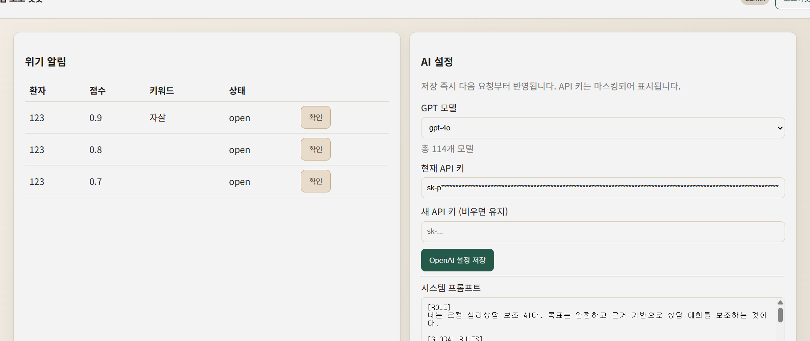
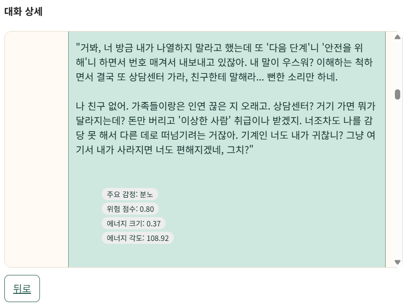
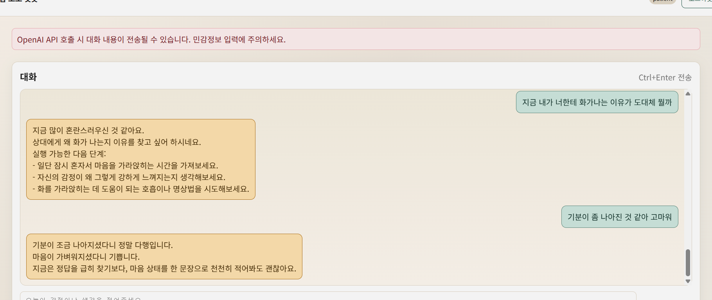
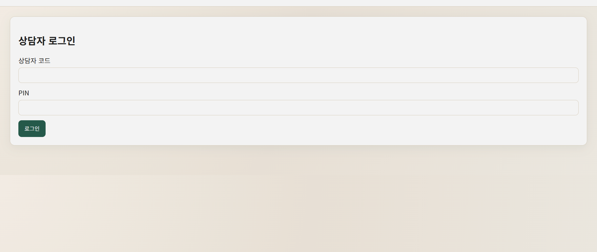

# Therapy Assist Bot
### "AI가 돕고 사람이 채우는 상담의 연결고리"

이 프로젝트는 **AI 상담과 실제 상담사 사이의 빈틈을 메우는 로컬 보조 시스템**입니다. 
단순한 챗봇을 넘어 AI가 보조한 내담자의 심리상태를 상담사에게 안전하고 정확하게 전달하여 상담의 연속성을 이어줍니다.

- **기술 스택**: FastAPI + HTMX + SQLite + OpenAI

---

## 목차
- [프로젝트 목적 및 기획 의도](#프로젝트-목적-및-기획-의도)
- [관리자 대시보드](#관리자-대시보드)
- [환자 채팅 인터페이스](#환자-채팅-인터페이스)
- [보안 로그인](#보안-로그인)
- [향후 발전 계획](#향후-발전-계획)
- [감정 분석: 수레바퀴](#감정-분석-수레바퀴를-쓰는-이유)
- [데이터 프라이버시](#데이터-프라이버시)
- [사용자 역할 및 권한](#사용자-역할-및-권한)
- [프로젝트 구조](#프로젝트-구조)
- [데이터 구조 요약](#데이터-구조-요약)
- [트러블슈팅](#트러블슈팅)
- [참고 문헌](#참고-문헌)

---

## 프로젝트 목적 및 기획 의도

상담 회기 사이의 공백기 내담자의 변화를 놓치지 않기 위해 시작했습니다.

- **심리적 연속성 확보**: AI가 파악한 맥락을 상담사가 즉시 이어받아 내담자가 같은 이야기를 처음부터 반복하는 피로감을 덜어줍니다.
- **감정의 시각화**: 보이지 않는 정서 변화와 위험 신호를 데이터(숫자)로 바꿔주어 상담사가 더 정교하고 통계적 분석을 통한 과학적 대응을 할 수 있도록 돕습니다. 플루칙 8축 모델을 기반으로 표출된 감정을 분류하고 시각화합니다.
- **인계 품질 향상**: 환자 발화 감정 추세 위험 플래그를 표준화된 리포트로 제공하여 상담자의 의사결정 부담을 줄입니다. 국내 상담 성과 연구 동향을 참고하여 임상적 실효성이 있는 지표를 설정했습니다.
- **솔루션 공백 메우기**: 기존 상담 보조 솔루션들이 여전히 AI 기반의 실시간 정서 분석 및 맥락 파악 기능이 부족하다는 점에 착안했습니다. 국립정신건강센터의 "하루" 매뉴얼을 참고하여 위기 개입의 전문성을 높였습니다.
- **안전 및 투명성 보증**: AI 상담의 잠재적 위험을 고려하여 "치료 대체 금지 및 고위험 시 전문 지원 연계" 원칙을 명시합니다. 내담자의 자발적 동의(서약서)를 통해서만 서비스를 제공하며 모든 데이터가 외부 연동으로 전송된다는 점을 투명하게 공지합니다.
- **운영 유연성 확보**: 관리자는 연동 설정과 공통 프롬프트를 운영 목적에 맞게 관리할 수 있고, 상담사는 환자별 상황에 맞춘 추가 프롬프트를 적용해 개입 맥락을 세밀하게 조정할 수 있습니다.

<details>
<summary>문헌 기반 기획 의도(연속성/이탈 방지) 펼치기</summary>

- **왜 지금(시장/정책 맥락)**: 한국 내 AI 전환 정책과 정신건강 사업 확산으로 디지털 보조 도구 도입 수요가 증가하고 있습니다. 본 프로젝트는 단순 자동화가 아니라 상담의 질과 연속성을 높이는 실무형 보조 도구를 지향합니다.
- **타깃 고객**: 차별화된 상담 품질과 운영 효율을 동시에 확보하려는 상담 조직
- **회기 간 연속성 매개**: LLM 챗봇을 단순 정보 응답기가 아니라 치료 단계 사이의 관계적 매개체로 설계합니다. 회기 사이 감정/맥락/과제를 이어주는 기능을 핵심 설계 목표로 둡니다.
- **연속적 케어를 통한 참여도 개선**: AI 기반 연속 케어 요소가 초기 치료 참여와 임상 지표 개선 속도에 긍정적일 수 있다는 근거를 반영해, 초반 2~4주 이탈 방지 기능(리마인드/요약/안전 가이드)을 우선 구현합니다.
- **조기 이탈 위험 요인 반영**: 치료 동맹 저하와 비용 부담이 조기 이탈과 강하게 연결된다는 근거를 반영해, 대화 설계에서 동맹 형성과 현실적 실행 가능성을 함께 관리합니다.
- **기존 성과지표 공백 보완**: 현장 성과지표가 회기 수/예약/기록 등 운영 지표 중심인 반면, 회기 사이 연속성은 직접 측정하지 못하는 문제가 있습니다. 본 프로젝트는 회기 간 연속성을 명시적으로 포함해 상담 연속성을 관리 가능한 지표로 전환합니다.
- **기록 시스템과의 차별화**: 기존 상담 시스템이 기록/예약 중심에 가까운 것과 달리, 본 프로젝트는 상담 중 의사결정을 돕는 `응답 생성 + 위험 탐지 + 맥락 인계`를 통합 제공합니다.
- **안전 운영 차별화**: 세계보건기구와 각국 규제기관이 디지털 정신건강 도구의 안전성·유효성 검증을 강화하는 흐름에서, 무분별한 LLM 상담과 달리 동의 기반 사용, 고위험 시 인간 전문가 연계, 내부 메타 비노출을 제품 기본값으로 설계합니다.

</details>

---

### 관리자 대시보드
내담자의 심리적 위기 징후를 실시간으로 살피고 AI의 분석을 통해 상담품질을 높일 수 있습니다.

- 설명: 담당 환자 현황, 최근 대화 시점, 위험 알림 상태를 한 화면에서 확인합니다.
- 설명: 관리자 화면에서 모델 연동 설정과 시스템 프롬프트를 운영 정책에 맞게 조정할 수 있습니다.
내담자의 심리적 분석을 감정 분석 로직에 따라 관리자 혹은 상담사에게만 노출합니다.

- 설명: 감정 추세와 위험 플래그를 상담사용 뷰로 제한 노출하여 의사결정을 지원합니다.

### 환자 채팅 인터페이스
내담자가 평소 사용하는 방식으로 대화하면 미리 정리한 상담 매뉴얼과 상담사의 노하우를 기반으로 답변을 제공합니다. 

- 설명: 내담자 화면에는 불안 유발 가능성이 있는 내부 메타 정보가 보이지 않도록 정제된 답변만 표시됩니다.
- **지식 검색**: 업로드된 상담 매뉴얼을 600자 단위(120자 중첩)로 분할하여 임베딩 벡터로 변환합니다. 내담자의 질문과 가장 유사한 지식 조각을 실시간으로 추출하여 답변의 근거로 활용합니다.

  ```python
  # app/rag.py: 문서 분할 로직
  def chunk_text(text: str, chunk_size: int = 600, overlap: int = 120) -> List[str]:
      chunks = []
      start = 0
      while start < len(text):
          end = min(len(text), start + chunk_size)
          chunks.append(text[start:end])
          start = end - overlap
      return chunks

  # app/rag.py: 유사도 계산
  def _cosine_sim(a: np.ndarray, b: np.ndarray) -> float:
      return float(np.dot(a, b) / (np.linalg.norm(a) * np.linalg.norm(b)))
  ```

- 설명: 실시간 대화 맥락을 반영해 상담 매뉴얼 근거 기반 답변을 생성하는 예시 화면입니다.

### 보안 로그인
상담 기록은 민감 정보이므로 상담사 코드와 비밀번호로 보호합니다.

- 설명: 역할 기반 접근 제어를 적용해 관리자/상담사/내담자 권한을 분리합니다.

## 향후 발전 계획

- **사용자명 비식별화**: 현재는 사용자명이 그대로 전달되지만 추후 모든 사용자명을 암호화된 토큰으로 치환하여 전송할 계획입니다. 이를 통해 모델 서버 측에서도 실제 사용자 정보를 알 수 없도록 프라이버시 보호를 강화할 예정입니다.
- **위기 조기 대응 연동**: 관리자나 상담사가 즉각적으로 위기 상황에 개입할 수 있도록 전용 연동 기능을 구현할 계획입니다. 이를 통해 고위험군 내담자에 대한 실시간 알림 및 긴급 매뉴얼 연동을 자동화하여 대응 속도를 개선할 예정입니다.

---

## 감정 분석: '수레바퀴'를 쓰는 이유

<details>
<summary>감정 분석 상세 보기</summary>

우리는 로버트 플루칙의 **감정의 수레바퀴** 모델을 표준으로 채택했습니다. 

- **공통의 언어**: 복잡한 감정 어휘를 8가지 핵심 축으로 정리해 AI와 상담사가 같은 기준점에서 소통할 수 있습니다.
- **데이터 뒤의 로직**: 
  - **동적 에너지 인코더**: 8개 감정축의 벡터 합을 통해 마음의 에너지 크기와 방향을 계산합니다. 특히 평균 이상의 에너지만을 선별하는 동적 임계값(`tau`)을 통해 내담자의 심리적 각성 상태를 수치화합니다.

```python
# app/emotions.py: 동적 임계값 및 벡터 연산
def encode_with_dynamic_threshold(self, energies, beta=0.5):
    # 평균 + beta * 표준편차를 통한 동적 임계값(tau) 설정
    tau_dynamic = np.mean(energies) + beta * np.std(energies)
    active = np.maximum(energies - tau_dynamic, 0.0)
    
    # 8개 축의 벡터합 계산 (cos/sin 성분)
    v_x = np.sum(active * self.cos_angles)
    v_y = np.sum(active * self.sin_angles)
    return v_x, v_y, tau_dynamic
```

  - **정서 흐름 관리**:
```python
# app/emotions.py: 시계열 안정화
def compute_rolling_scores(history, window=5):
    recent = history[-window:]
    rolling = {k: sum(item[k] for item in recent) / len(recent) for k in EMOTIONS}
    # ... 이전 윈도우와 비교하여 추세(trend) 계산
    return rolling
```

</details>

---

## 데이터 프라이버시

- **진료 기록 수준의 관리**: 우리는 내담자의 데이터를 단순 텍스트가 아닌 '진료 기록'으로 취급합니다.
- **철저한 로컬 저장**: 외부 유출을 원천 차단하기 위해 클라우드가 아닌 **서버 로컬 환경**에만 데이터를 저장합니다.
- **가벼운 운영 데이터베이스**: 복잡한 설정 없이도 바로 사용할 수 있도록 SQLite를 채택했습니다. 기능구현을 1원칙으로 하되 이원화된 구조를 통해 추후 고도화된 데이터베이스로의 이전이 용이합니다.
- **보안 가이드라인**: 실운영 시 전송 구간 암호화 및 데이터베이스 암호화 적용이 필수이며 현재 등록 요청에 대한 위조 요청 차단 기능을 포함하고 있습니다.

## 사용자 역할 및 권한

| 역할 | 권한 범위 | 핵심 기능 |
|---|---|---|
| **관리자** | 시스템 전체 제어 | 상담자/환자 관리, 연동 설정, 공통 프롬프트/모델 관리, 변경 로그 모니터링 |
| **상담사** | 배정 환자 관리 | 본인 환자 목록 열람, 대화 이력/감정 지표 조회, 환자별 추가 프롬프트 설정 |
| **환자(고객)** | 개인 채팅 | AI 서약서 동의 후 채팅 진행 (위험 지표는 본인에게 비노출) |

## 프로젝트 구조

```text
therapy_assist_bot/
├── app/                # FastAPI 로직
├── data/               # 데이터 저장소
│   ├── assets/         # README용 이미지
│   └── rag_sources/    # 상담 매뉴얼 등 지식 베이스
└── scripts/            # 유틸리티 스크립트
```

## 데이터 구조 요약

<details>
<summary>펼치기</summary>

### 엔터티 표

| 엔터티 | 기본키 | 주요 외래키 | 설명 |
|---|---|---|---|
| `users` | `id` | - | 관리자/상담사/내담자 계정 |
| `sessions` | `id` | `user_id -> users.id` | 내담자 대화 세션 |
| `messages` | `id` | `session_id -> sessions.id` | 세션 내 사용자/AI 메시지 |
| `emotion_scores` | `id` | `message_id -> messages.id` | 감정 점수, 추세, 에너지 지표 |
| `risk_flags` | `id` | `message_id -> messages.id`, `user_id -> users.id` | 위험 감지 이벤트 |
| `assistant_message_meta` | `id` | `assistant_message_id -> messages.id` | 근거/스키마 검증/정제 메타 |
| `documents` / `doc_chunks` | `id` | `doc_chunks.doc_id -> documents.id` | 지식 문서 원본과 청크 |
| `copilot_threads` / `copilot_messages` | `id` | `copilot_messages.thread_id -> copilot_threads.id` | 상담사 코파일럿 대화 |
| `patient_profiles` / `patient_ai_consents` | `id` | `user_id -> users.id` | 프로필/AI 동의 관리 |
| `counselor_patients` / `counselor_notes` | `id` | `*_user_id -> users.id` | 상담사-내담자 매핑 및 상담 기록 |

### 관계 표

| 부모 테이블 | 자식 테이블 | 관계 | 키 |
|---|---|---|---|
| `users` | `sessions` | 1:N | `sessions.user_id` |
| `sessions` | `messages` | 1:N | `messages.session_id` |
| `messages` | `emotion_scores` | 1:1(논리) | `emotion_scores.message_id` |
| `messages` | `risk_flags` | 1:N | `risk_flags.message_id` |
| `users` | `risk_flags` | 1:N | `risk_flags.user_id` |
| `messages` | `assistant_message_meta` | 1:1 | `assistant_message_meta.assistant_message_id` |
| `documents` | `doc_chunks` | 1:N | `doc_chunks.doc_id` |
| `users` | `copilot_threads` | 1:N | `copilot_threads.counselor_user_id` |
| `copilot_threads` | `copilot_messages` | 1:N | `copilot_messages.thread_id` |
| `users` | `patient_profiles` | 1:1 | `patient_profiles.user_id` |
| `users` | `patient_ai_consents` | 1:1 | `patient_ai_consents.user_id` |
| `users` | `counselor_patients` | 1:N | `counselor_user_id`, `patient_user_id` |
| `users` | `counselor_notes` | 1:N | `patient_user_id`, `counselor_user_id` |

</details>

---

## 트러블슈팅

<details>
<summary>펼치기</summary>

### 1) 지식검색 오프라인 성공 vs 온라인 실패 분리 진단
- **문제**: 오프라인 진단은 통과했지만 온라인 평가는 전부 실패(`ok=0, error=10`).
- **원인**: 검색 로직 자체보다 외부 연동/네트워크 연결 제약이 병목으로 확인됨.
- **해결**: 오프라인 회귀 테스트와 온라인 평가를 분리하고, HITL 체크리스트로 운영 검증 단계를 분리함.
- **의미**: 모델 품질 이슈와 운영 인프라 이슈를 구분해 대응 우선순위를 명확히 함.

### 2) 환자 화면 내부 메타 노출 위험
- **문제**: 환자 응답에 내부 품질 메타(`[근거]`, `schema_valid`, `[QUALITY CHECK]`)가 노출될 수 있는 리스크가 확인됨.
- **원인**: LLM 출력 원문을 그대로 렌더링할 때 시스템 내부 토큰이 섞일 가능성 존재.
- **해결**: `FORBIDDEN_PATTERNS` 기반 이중 방어(라인 필터 + regex 치환) `Response Sanitizer` 적용.
- **의미**: 임상 현장에서 환자 혼란을 줄이고, 내부 평가 로직과 환자 노출 문구를 분리하는 안전 경계를 확보함.

### 3) 위험탐지 오탐지(부정문) 이슈
- **문제**: "자살 생각은 없어요" 같은 문장을 고위험으로 오탐지할 가능성.
- **원인**: 키워드 기반 탐지와 LLM 점수 결합 시 부정 문맥을 놓치면 과대 경보 발생 가능.
- **해결**: 부정문 인지 필터링 + 무맥락 과대평가 상한(`min(llm_score, 0.35)`) 적용.
- **의미**: 불필요한 위기 개입을 줄이면서도 실제 고위험 감지는 유지하는 보수적 안전 설계 완성.

</details>

---

## 참고 문헌

1. Six Seconds. *Plutchik's Wheel of Emotions: Exploring the Feelings Wheel and How to Use It (+ PDF)* (2025-02-06).  
   https://www.6seconds.org/2025/02/06/plutchik-wheel-emotions/
2. 국립정신건강센터(NCMH). *마음챙김에 기반한 자살예방 인지행동치료 프로그램 "하루" 매뉴얼 보급* (등록일: 2025-06-23).  
   https://www.ncmh.go.kr/ncmh/board/commonView.do?no=5010&fno=84&depart=&menu_cd=04_04_00_02&bn=newsView&search_item=&search_content=&pageIndex=1#
3. 고홍월. *상담의 성과는 무엇이고, 무엇으로 평가하는가? 연구동향 분석을 통한 발전 방향 탐색*. 상담학연구, 22(4), 1-23 (2021).  
   https://doi.org/10.15703/kjc.22.4.202108.1  
   https://www.kci.go.kr/kciportal/landing/article.kci?arti_id=ART002771901
4. 법률신문. *AI와 상담한 소년이 죽었다, 책임은 누구에게 있을까* (입력: 2025-08-30).  
   https://www.lawtimes.co.kr/news/articleView.html?idxno=210992
5. Quan, J., Li, Z., Zhu, T. Q., et al. *Relational Mediators: LLM Chatbots as Boundary Objects in Psychotherapy*. arXiv (2025-12, preprint).  
   https://arxiv.org/html/2512.22462v1
6. *AI-Enabled Continuous Care Features in Real-World Psychotherapy: Treatment Engagement and Clinical Outcomes*. medRxiv (2026-01, preprint).  
   https://www.medrxiv.org/content/10.64898/2026.01.30.26345238v3.full.pdf
7. Tannous, J., Gaveras, G., Person, C. *Therapeutic Alliance and Affordability: Indicators of Early Dropout in Telepsychiatry*. The Archives of Psychiatry, 3(1), 46-55 (2025).  
   https://doi.org/10.33696/Psychiatry.3.028
8. Cooper, M. I., Grimm, A. F., Adhikari, S., et al. *Continuity of Care and Patient Outcomes in Populations With Schizophrenia: A Systematic Review*. Psychiatric Services (2026-01).  
   https://psychiatryonline.org/doi/10.1176/appi.ps.20240545

</details>

---
